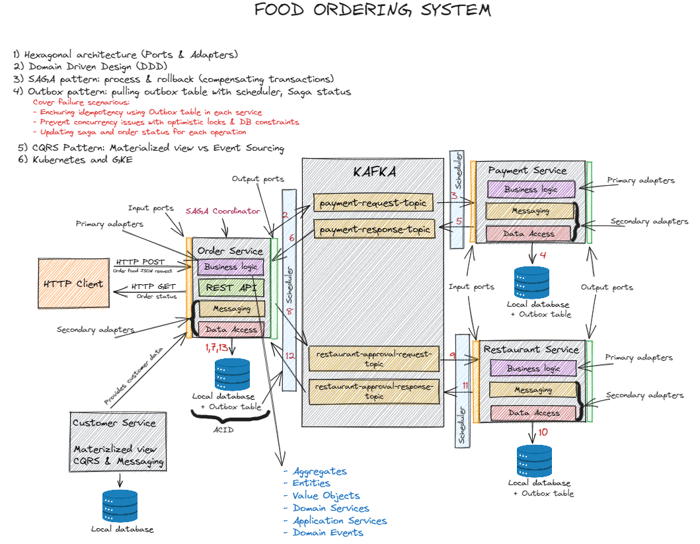
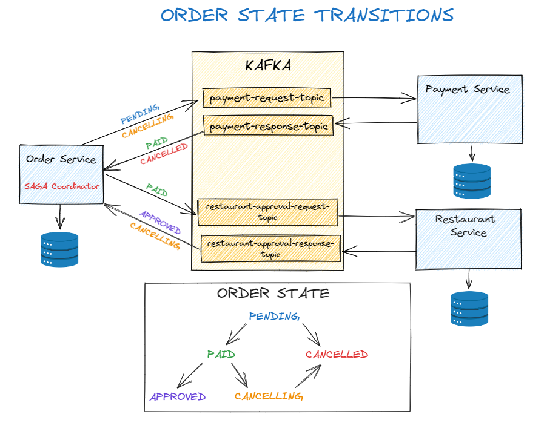
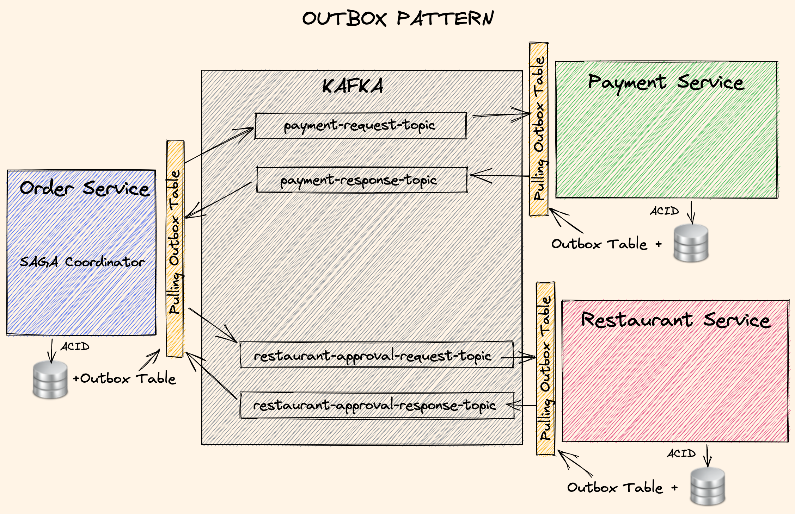
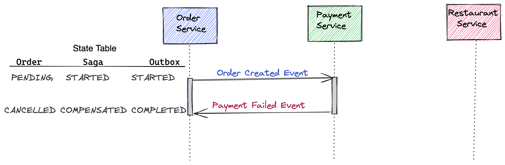
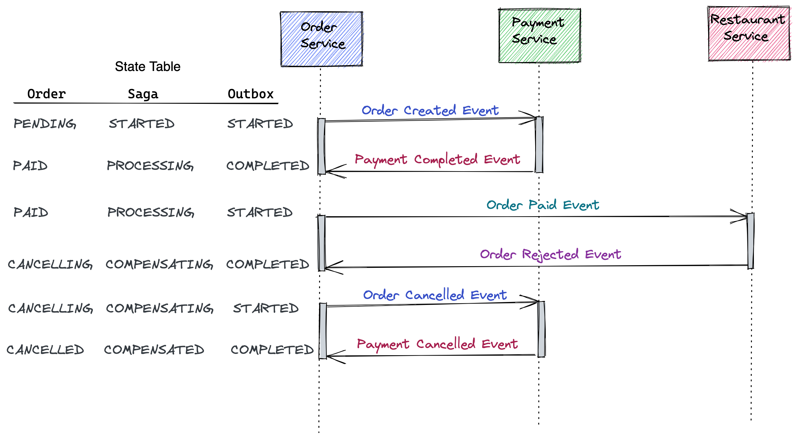
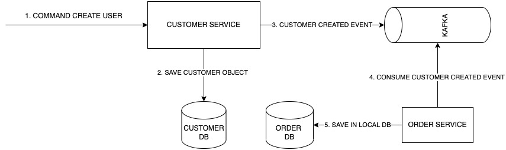
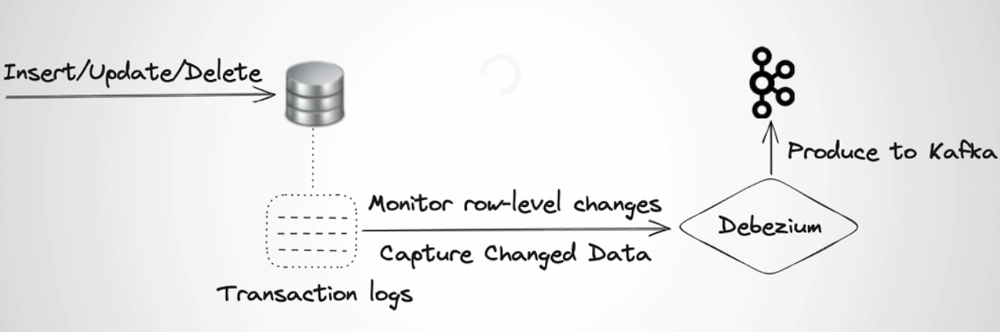
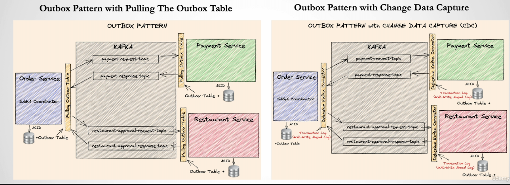

# Food ordering system overview #
Spring boot microservices with Clean & Hexagonal architectures, DDD, SAGA, Outbox, CQRS, Kafka.
During this project, I wrote some articles about architectures and technologies that I used in this project:
- Domain-Driven-Design(DDD) [Blog](https://itaha.hashnode.dev/microservices-domain-driven-design-ddd)
- Hexagonal architecture    [Blog](https://itaha.hashnode.dev/hexagonal-architecture)

### Microservices and Key Components:

1. **Order Service:**
- This microservice acts as the entry point for customer order requests.
- It receives requests via REST API and coordinates the order lifecycle.
- It uses hexagonal architecture and implements the SAGA pattern to ensure effective coordination of distributed transactions.
- The messaging component integrates with the Kafka cluster for asynchronous communication, enabling efficient application of the CQRS pattern.
2. **Payment Service:**
- Responsible for issuing and controlling order payments.
- Ensures the security and efficiency of financial transactions by integrating with reliable payment gateways.
- Its implementation adopts hexagonal architecture.
3. **Restaurant Service:**
- Manages order confirmation by restaurants and keeps customers informed about the preparation status.
- This microservice is essential for ensuring efficient communication between customers and partner establishments.
4. **Customer Service:**
- Service that provides services for consumer management.
5. **Kafka (Cluster):**
- The Kafka cluster is used for asynchronous communication between microservices using the CQRS (Command Query Responsibility Segregation) pattern, separating read and write operations to improve system performance and scalability.

Each component of the architecture is designed to play a specific role in the effectiveness of the Food Ordering System.
# Requirements
- [Java 17](https://www.oracle.com/technetwork/pt/java/javase/downloads/index.html)
- [Maven 3.9.x+](https://maven.apache.org/download.cgi)
- [PostgreSQL](https://www.postgresql.org/)
- [Apache Kafka](https://kafka.apache.org/)
- Docker
- Docker-Compose
- [Rancher Desktop](https://rancherdesktop.io/) or [Docker Desktop](https://www.docker.com/products/docker-desktop/) for Windows platform (optional)
- [Postman](https://www.postman.com/) (opcional)
- [GraphViz](https://graphviz.org/download/) (opcional)

### Dependencies
The project uses several essential libraries for its development and effective operation. The main libraries and dependencies include:
- **Spring Boot Starter Validation**: Essential for data validation, this Spring Boot library provides built-in support to ensure data integrity during CRUD operations.
- **Spring Boot Starter Web**: Used for web application development, this Spring Boot starter makes it easy to build RESTful APIs, contributing to the creation of the application's communication interface.
- **Spring Boot Starter Data JPA**: Facilitates integration with the PostgreSQL database, simplifying data persistence and retrieval operations.
- **Spring TX**: Spring package that provides support for transactions.
- **Spring Kafka**: Provides support for integration with Apache Kafka, enabling asynchronous communication between different components of the system.
- **Kafka AVRO Serializer**: Serializer plugin that helps in serializing/deserializing messages sent/received from Kafka using AVRO schemas.
- **Log4J**: Logging library.
- **Lombok**: A library that simplifies writing Java code, reducing the need for boilerplate code. Its use contributes to cleaner and more readable code.
- **Mockit**: Framework used in unit testing of applications.

# Customer Ordering Flow

- **Step 1: Request**: The first step represents the customer's request submitted through a REST request which, upon arrival at the Order Service, is validated.
- **Step 2: Persistence**: If the request is compliant, the user and order data are registered in the database.
- **Step 3: Publishing a payment request**: After that, the Order Service publishes a payment request on the Kafka topic tp-payment-request.
- **Step 4: Consuming a payment request**: The payment request is consumed by the Payment Service.
- **Step 5: Persistence of payment data**: The Payment Service processes the request and registers the payment data in the database.
- **Step 6: Publishing the payment request response**: The Payment Service publishes the result of the payment step on the topic tp-payment-response.
- **Step 7: Processing the payment response**: The Order Service receives the event response from the payment step and performs the processing.
- **Step 8: Persistence**: The data from the payment step is persisted in the local database.
- **Step 9: Publishing restaurant confirmation**: Once the payment is made, the Order Service publishes an event on the topic tp-restaurant-approval-request asking the restaurant to confirm the order.
- **Step 10: Consuming the confirmation request**: The Restaurant Service receives the message and processes the request.
- **Step 11: Persistence of the confirmation request**: The confirmation data is persisted in the database.
- **Step 12: Publishing the confirmation response**: Once the restaurant has confirmed or rejected the order, the response is published on the topic tp-restaurant-approval-response.
- **Step 13: Consuming the confirmation response**: The Order Service retrieves the response to the restaurant's confirmation request from the topic and performs the processing.
- **Step 14: Persistence**: The restaurant confirmation data is persisted in the local database, ending the customer order flow.

### Order state transitions ###


## DOMAIN DRIVEN DESIGN (DDD) FOR ORDER-SERVICE


## ORDER STATE TRANSITIONS


## OUTBOX PATTERN



### OUTBOX HAPPY FLOW


### OUTBOX PAYMENT FAILURE



### OUTBOX APPROVAL FAILURE



## CQRS



Yes, there is not strong consistency between local database operations and data publishing operation for the customer service, outbox pattern implementation can fix that.

## CHANGE DATA CAPTURE (CDC)

- Use Push method as opposed to Pulling

- Push database records into target source (Kafka) by reading from Transaction Logs (WAL in Postgres)

  

  Will be replacing the scheduler written in Java:

  

## API USAGE

1. POST request to http://localhost:8184/customers with JSON body:

```json
{
    "customerId":"d215b5f8-0249-4dc5-89a3-51fd148cfb41",
    "username": "user_1",
    "firstName": "Armando",
    "lastName": "Maradona"
}
```

2. POST request to http://localhost:8181/orders  request to with JSON body:

```json
{
  "customerId": "d215b5f8-0249-4dc5-89a3-51fd148cfb41",
  "restaurantId": "d215b5f8-0249-4dc5-89a3-51fd148cfb45",
  "address": {
    "street": "street_1",
    "postalCode": "1000AB",
    "city": "Amsterdam"
  },
  "price": 200.00,
  "items": [
    {
      "productId": "d215b5f8-0249-4dc5-89a3-51fd148cfb48",
      "quantity": 1,
      "price": 50.00,
      "subTotal": 50.00
    },
    {
      "productId": "d215b5f8-0249-4dc5-89a3-51fd148cfb48",
      "quantity": 3,
      "price": 50.00,
      "subTotal": 150.00
    }
  ]
}
```

3. Get the orderTrackingId from the response and query the result with a GET operation to http://localhost:8181/orders/toChangewithOrderTrackingId

You will see that first is PAID (payment-service replied), and roughly after 10 seconds, it is APPROVED (restaurant-service confirmed) if you continue to perform GET operation. Notice that if you perform the previous POST operation multiple times, it will fail, because there are not enough funds, and this can be an example of bad path.

## HOW TO LAUNCH THE SERVICES

0. Run Docker and Kubernetes

1. [Install helm](https://helm.sh/docs/intro/install/).

2. Type in terminal:

    ``` bash
    helm repo add my-repo https://charts.bitnami.com/bitnami
    helm install my-release my-repo/kafka
    helm install schema my-repo/schema-registry
    ```

3. From the project's root type in terminal: ```mvn clean install```

4. Go from terminal in the folder Event-Driven-Microservices-Advanced/infrastructure/k8s and type: ```kubectl apply -f kafka-client.yml```

5. Once the pod is running type in terminal: ```kubectl exec -it kafka-client -- /bin/bash ```

6. Once in the container, let's create the topics needed for running the applications:

   ```bash
   kafka-topics --bootstrap-server my-release-kafka:9092 --create --if-not-exists --topic payment-request --replication-factor 1 --partitions 3
   kafka-topics --bootstrap-server my-release-kafka:9092 --create --if-not-exists --topic payment-response --replication-factor 1 --partitions 3
   kafka-topics --bootstrap-server my-release-kafka:9092 --create --if-not-exists --topic restaurant-approval-request --replication-factor 1 --partitions 3
   kafka-topics --bootstrap-server my-release-kafka:9092 --create --if-not-exists --topic restaurant-approval-response --replication-factor 1 --partitions 3
   kafka-topics --bootstrap-server my-release-kafka:9092 --create --if-not-exists --topic customer --replication-factor 1 --partitions 3
   ```

7. While still inside the container let's verify that all 5 topics have been created with: ```kafka-topics --zookeeper my-release-zookeeper:2181 --list```
8. Exit from the container and from the folder Event-Driven-Microservices-Advanced/infrastructure/k8s , type: ```kubectl apply -f postgres-deployment.yml ```
9. Wait that postgres is running and after type: ```kubectl apply -f application-deployment-local.yml```
